## 毕设源码仓库目录

[更多毕设源码、论文，供学弟学妹们选择 ~~>](https://github.com/TensorCEO#-%E5%8E%9F%E5%88%9B%E6%BA%90%E7%A0%81)

---

<div align="center">
  <h1 align="center">基于机器学习与智能优化的糖尿病风险预测研究</h1>
  <p align="center"><strong>Diabetes Risk Prediction Research Based on Machine Learning and Intelligent Optimization</strong></p>

  <p align="center">
    
    
    
  </p>

  <p align="center">QQ：604329062（获取完整毕设源码）</p>
  <p align="center">毕设之家QQ交流群：1095146693（进群获取毕设范文和免费资料）</p>
</div>

---

## 项目介绍

本项目围绕糖尿病风险预测任务，构建了“数据预处理 - 探索性数据分析 - 基线模型比较 - 随机森林优化”的完整实验链路。项目以 Kaggle 糖尿病预测数据集为基础，使用 `pandas`、`scikit-learn`、`xgboost`、`bayesian-optimization`、`geneticalgorithm` 等工具完成数据清洗、类别编码、模型训练、超参数优化、指标评估与结果可视化，适合作为机器学习类毕业设计或课程设计参考项目。

| 项目维度 | 内容说明 |
| --- | --- |
| 项目类型 | 毕业设计 / 机器学习 / 数据分析 |
| 技术栈 | Python、pandas、scikit-learn、xgboost、matplotlib、openpyxl |
| 核心功能 | 数据清洗、类别编码、EDA分析、基线模型比较、随机森林优化、结果可视化 |
| 包含内容 | 源码、论文、项目说明书、实验结果图表、README展示截图 |
| 适用场景 | 毕业设计、课程设计、机器学习建模实践、医疗数据分析入门 |

---

## 技术架构

```text
数据层：Excel 原始数据 / 处理后数据 / 编码映射文件
分析层：数据清洗 / 类别编码 / 探索性数据分析（EDA）
建模层：RandomForest / SVM / GaussianNB / XGBoost
优化层：GridSearchCV / Bayesian Optimization / Genetic Algorithm
输出层：Excel 指标汇总 / ROC 曲线 / 混淆矩阵 / 准确率与 F1 可视化
运行方式：本地 Python 环境运行，适合离线实验、论文撰写与答辩展示
```

---

## 项目结构

```text
基于机器学习与智能优化的糖尿病风险预测研究(源码+论文)/
├─ code/                 # 核心实验脚本与 Notebook
├─ app/                  # 预留的 Web 入口与静态资源目录
├─ data/                 # 原始数据、处理后数据、缓存与测试目录
├─ model/                # 模型文件目录（当前为空）
├─ result/               # EDA 图表、基线模型结果、优化模型结果
├─ 项目资料/             # 项目说明书与项目文档
├─ 论文资料/             # 论文文档备份
├─ 素材/                 # README、展示截图、论文截图、说明书截图
└─ requirements.txt      # Python 依赖清单
```

---

## 资源说明

本项目包含以下内容：

- 完整原创源码
- 中文与英文论文文档
- 项目说明书与实验结果文件
- README 展示截图与论文相关截图

---

## 演示视频

- 当前仓库未提供演示视频文件，可结合 `项目资料/项目说明书.md`、论文文档以及 `result/` 下图表进行答辩展示

---

## 项目展示图

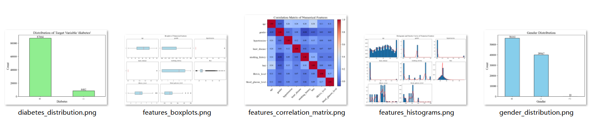
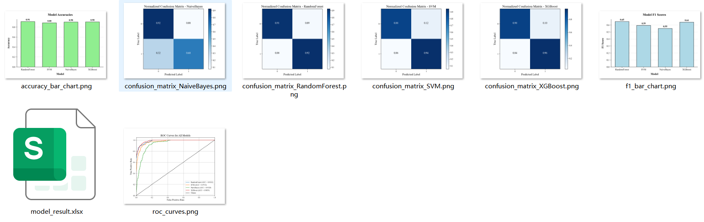
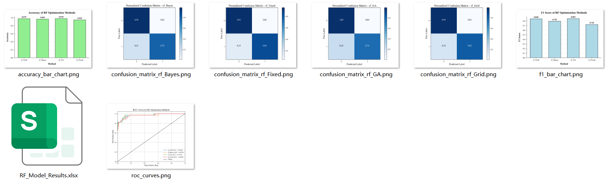
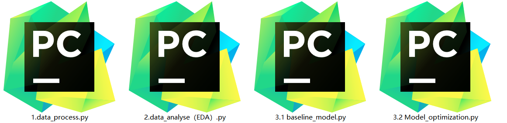
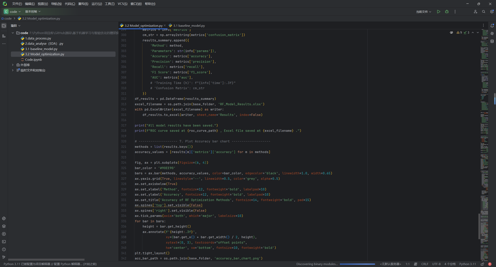
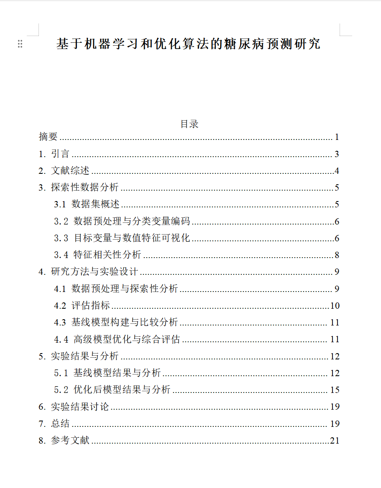
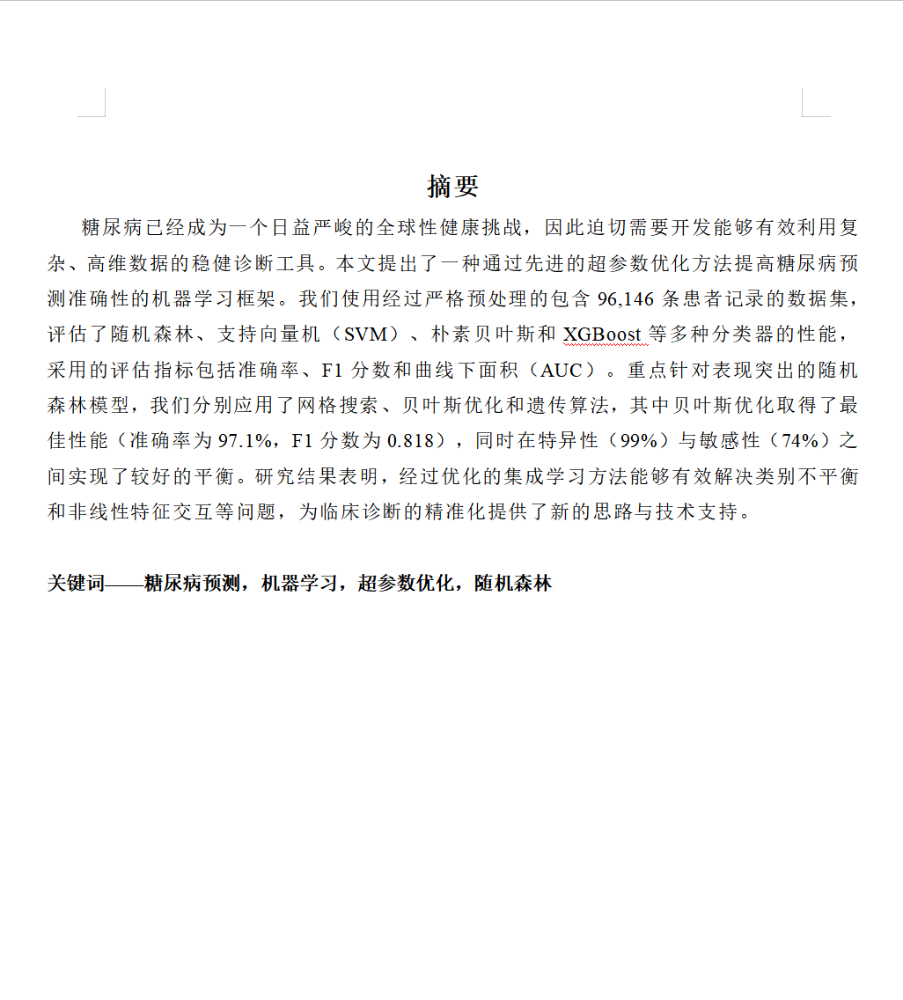
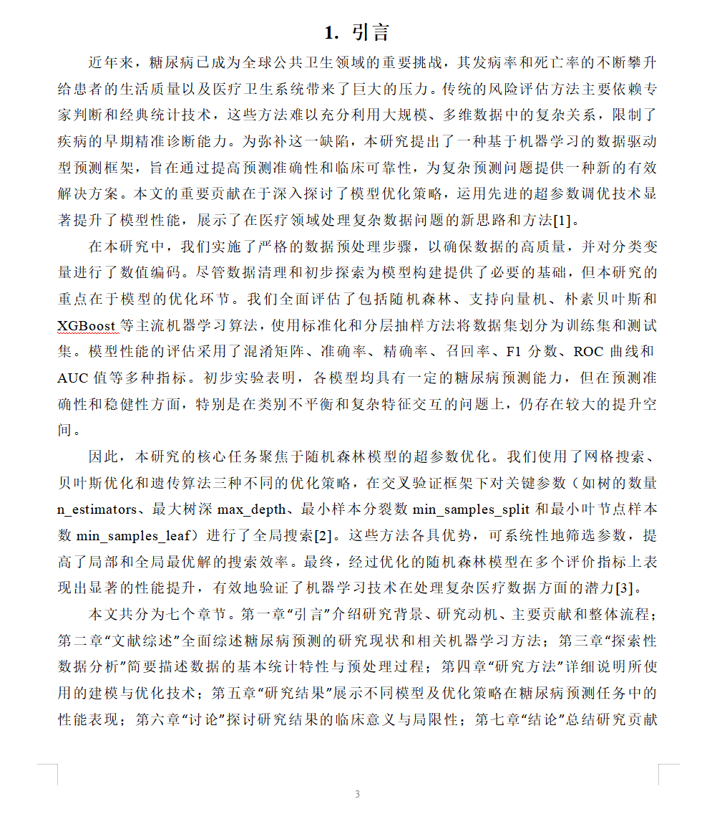
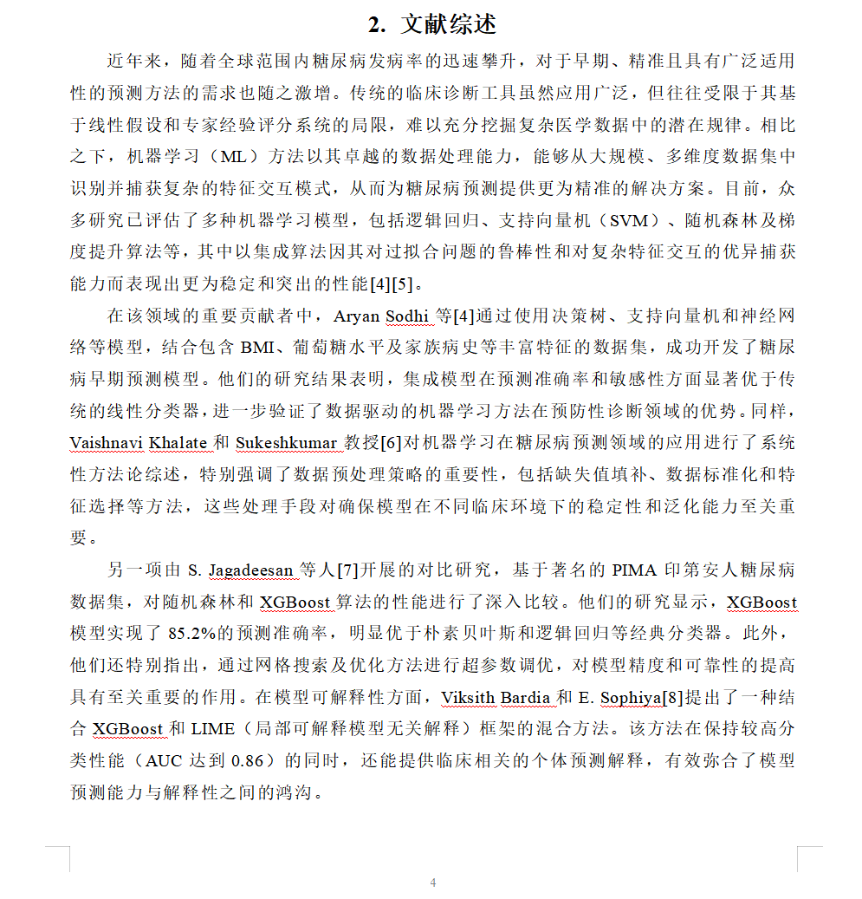
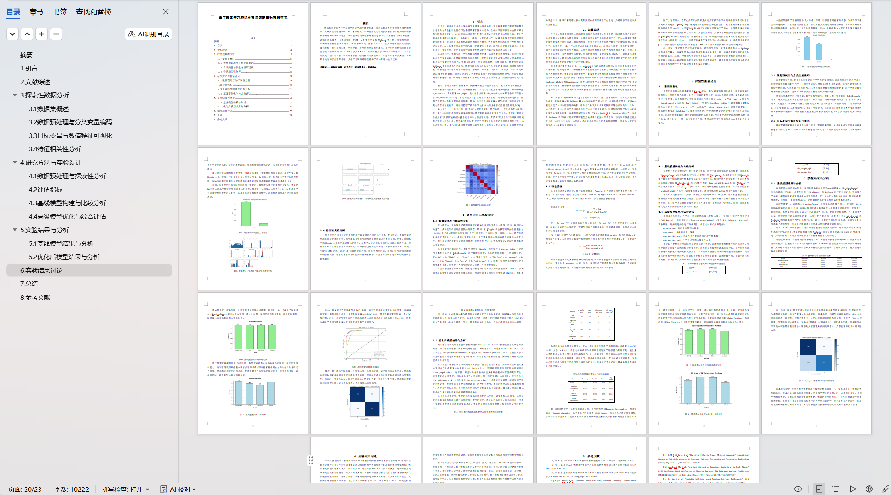
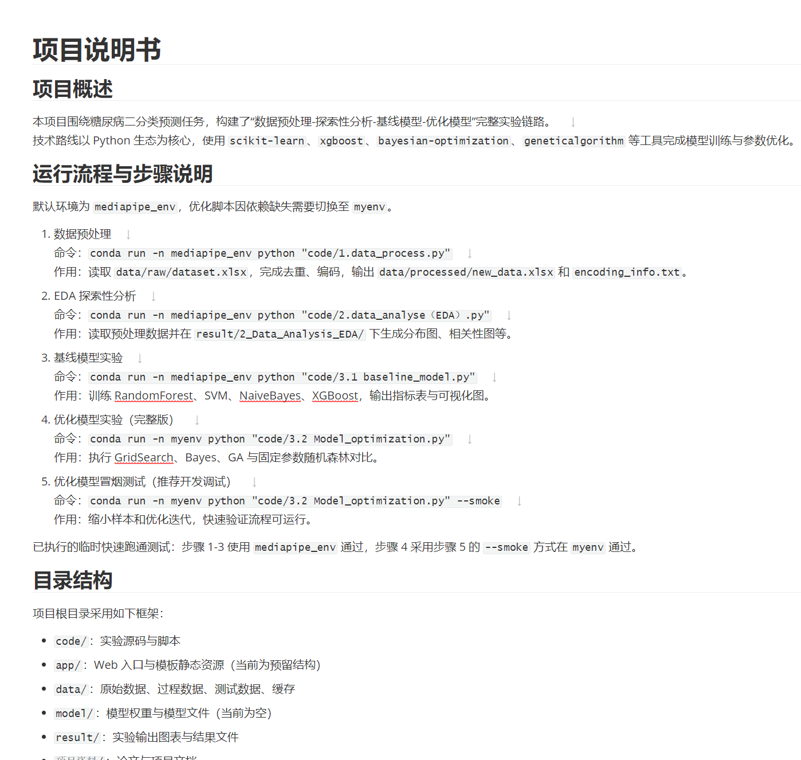
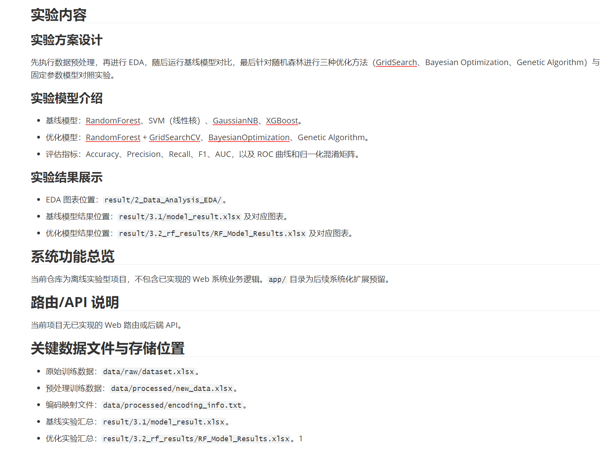
